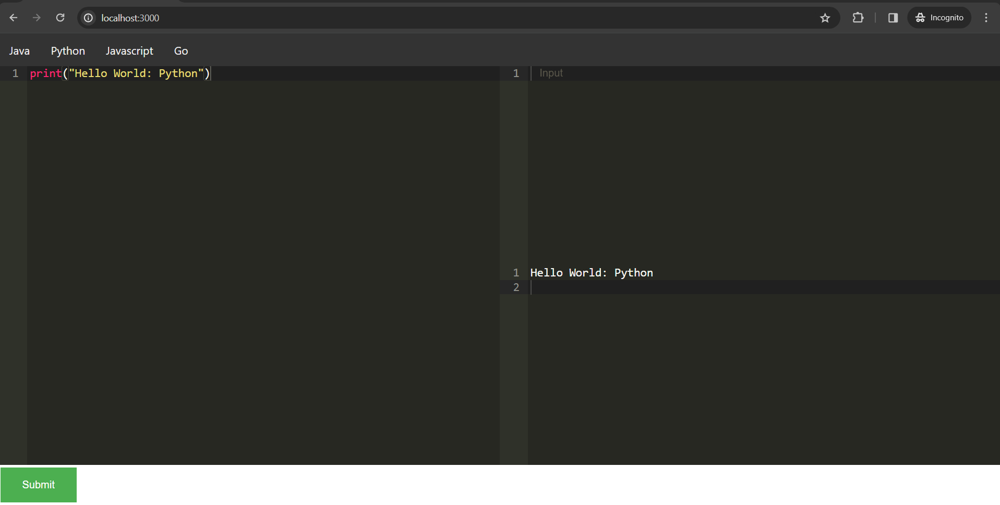

# 
Online Compiler

## To run the project:

### 1. Make sure docker is running.

### 2. Clone the repository:
> git clone https://github.com/saket-shetty/Online-Compiler

### 3. Navigate to the folder:
> cd Online-Compiler

### 4. Run the docker-compose file:
> docker-compose up --build

### 5. Frontend would be running at localhost:3000

### 6. Please give a star to the project if you find it helpfull 😊

---

### If you're facing any issue while running it feel free to contact me or open an issue.

### Contact: shettysaket05@gmail.com